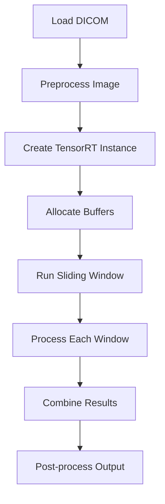

# Old Code vs New Code: Key Differences and Improvements

## 1. Context and Resource Management Issues in Old Code

### Previous Issues:
```python
# Old Code
def get_inference_with_sliding_window(one_dicom_path, engine):
    inputs, outputs, bindings, stream = allocate_buffers(engine, engine.create_execution_context(), input_shape, batch_size)
    def inference_func(image_slice):
        inputs, outputs, bindings, stream = allocate_buffers(engine, engine.create_execution_context(), input_shape, batch_size)
        return run_inference(engine, inputs, outputs, bindings, stream, image_slice.to(device), num_classes)
```

**Problems:**
1. Creating new context for every inference (expensive)
2. Allocating new buffers repeatedly
3. No proper cleanup of resources
4. Inconsistent device handling

### Fixed in New Code:
```python
# New Code
class TensorRTInference:
    def __init__(self, engine_path):
        self.context = self.engine.create_execution_context()
        self.stream = cuda.Stream()
        self.inputs, self.outputs, self.bindings = self._allocate_buffers()
        
    def run_inference(self, input_tensor):
        # Reuse context, stream, and buffers
```

## 2. Stream Handling Improvements

### Old Code Issues:
```python
def run_inference(engine, inputs, outputs, bindings, stream, dummy_input_here, num_classes):
    context.execute_v2(bindings=bindings)
    cuda.memcpy_dtoh_async(outputs[0]['host'], outputs[0]['device'], stream)
```

**Problems:**
1. No proper stream synchronization
2. New stream created for each inference
3. Async operations not properly managed

### Fixed in New Code:
```python
def run_inference(self, input_tensor):
    cuda.memcpy_htod_async(self.inputs[0]['device'], 
                          self.inputs[0]['host'], 
                          self.stream)
    self.context.execute_async_v2(bindings=self.bindings, 
                                 stream_handle=self.stream.handle)
    self.stream.synchronize()
```

## 3. Memory Management and Device Consistency

### Old Code Issues:
```python
def read_dicom_image(one_dicom_path):
    reshaped = torch.from_numpy(pixel_array).unsqueeze(0).unsqueeze(0).float()
    return reshaped  # No device specification
```

**Problems:**
1. Inconsistent device placement
2. Memory leaks from repeated buffer allocation
3. No input validation

### Fixed in New Code:
```python
def process_dicom(dicom_path):
    tensor = torch.from_numpy(pixel_array)
    tensor = tensor.unsqueeze(0).unsqueeze(0)
    return tensor.to(self.device)
```

# New Code Architecture Explanation

## 1. TensorRTInference Class Structure

```python
class TensorRTInference:
    """Main class handling all TensorRT operations"""
    
    def __init__(self):
        # Initialize once:
        # 1. Engine
        # 2. Context
        # 3. Stream
        # 4. Buffers
    
    def _allocate_buffers(self):
        # Allocate memory once
    
    def run_inference(self):
        # Reuse allocated resources
```

### Key Benefits:
- Single context creation
- Reusable buffers
- Proper resource management
- Consistent device handling

## 2. Improved Pipeline Flow



## 3. Error Handling and Validation

```python
def run_inference(self, input_tensor):
    try:
        # Validate input
        self._validate_input(input_tensor)
        
        # Run inference with proper error handling
        result = self._execute_inference(input_tensor)
        
        return result
    except Exception as e:
        logger.error(f"Inference failed: {str(e)}")
        raise
```

## 4. Memory Efficiency

### Before:
- Created new buffers for each window
- Multiple context creations
- Memory leaks possible

### After:
- Single buffer allocation
- Reused context
- Proper cleanup
- Monitored memory usage

## Best Practices Implemented

1. **Resource Management**
   - Single context creation
   - Proper buffer allocation
   - Stream synchronization

2. **Error Handling**
   - Input validation
   - Shape checking
   - Device consistency
   - Exception handling

3. **Performance Optimization**
   - Reusable resources
   - Async operations
   - Proper synchronization
   - Memory efficiency

4. **Code Organization**
   - Clear class structure
   - Separated concerns
   - Proper documentation
   - Type hints

## Usage Example

```python
# Initialize once
trt_inference = TensorRTInference("engine.trt")

# Use multiple times
for dicom_file in dicom_files:
    # Process each file
    segmentation = get_sliding_window_inference(
        dicom_file,
        trt_inference,
        roi_size=(64, 64)
    )
```
